# 🤖 Porter Request Analytics Chatbot - Documentation

## 1. Project Overview & Source Code

### Purpose
AI-powered chatbot that converts natural language queries into ClickHouse SQL for porter request analytics. Enables non-technical users to get instant insights from complex database queries using plain English.

### Key Capabilities
- **Natural Language Processing**: Convert English questions to SQL queries
- **Real-time Analytics**: Instant insights on porter performance, facility utilization, TAT analysis
- **Interactive Visualizations**: Auto-generated charts (bar, line, pie) based on query results
- **Multi-interface**: Web UI (Streamlit) and REST API (Flask)
- **Business Intelligence**: Built-in TAT calculations, timezone handling, status code mappings

### Source Code Structure
```
porter-analytics-chatbot/
├── main.py                 # Streamlit web application (primary interface)
├── api.py                  # Flask REST API for external integrations  
├── config.py               # Configuration management and schema definitions
├── deploy.sh               # Automated deployment script
├── test_chatbot.py         # Comprehensive testing suite
├── Dockerfile              # Container configuration
├── requirements.txt        # Python dependencies
├── .env.template          # Environment variables template
└── README.md              # User documentation
```

### Core Classes
- **PorterChatbot**: Main orchestrator, manages conversation flow
- **NLPToSQLConverter**: Azure OpenAI integration for query conversion
- **ClickHouseConnection**: Database connectivity and query execution
- **ResultFormatter**: Data formatting, timezone conversion, visualization

---

## 2. Tech Stack & Tools

### Backend Stack
| Component         | Technology          | Version     | Purpose                             |
|-------------------|---------------------|-------------|-------------------------------------|
| **Language**      | Python              | 3.9+        | Core application logic              |
| **Web Framework** | Streamlit           | 1.28.1      | Interactive web interface           |
| **API Framework** | Flask               | Latest      | REST API endpoints                  |
| **Database**      | ClickHouse          | Latest      | High-performance analytics database |
| **AI/ML**         | Azure OpenAI        | GPT-4o-mini | Natural language processing         |

### Key Dependencies
```
| Library              | Version | Purpose                          |
|----------------------|---------|----------------------------------|
| `clickhouse-connect` | 0.6.23  | ClickHouse database connectivity |
| `openai`             | 1.3.7   | Azure OpenAI API integration     |
| `pandas`             | 2.1.3   | Data manipulation and analysis   |
| `plotly`             | 5.17.0  | Interactive visualizations       |
| `python-dotenv`      | 1.0.0   | Environment variable management  |
| `pytz`               | 2023.3  | Timezone handling                |
```

### Infrastructure
- **Containerization**: Docker with multi-stage builds
- **Deployment**: Automated bash scripts with health checks
- **Testing**: Python unittest framework
- **Monitoring**: Comprehensive logging with rotation
- **Security**: Environment-based configuration, input validation

---

## 3. Flow Diagram

### Complete Request Processing Flow

```mermaid
flowchart TD
    A[User Input: Natural Language] --> B[Input Validation]
    B --> C[NLPToSQLConverter]
    C --> D[Azure OpenAI GPT-4o-mini]
    D --> E[Generated SQL Query]
    
    E --> F[SQL Enhancement Pipeline]
    F --> F1[Fix Facility ID Format: 184 → '0184']
    F1 --> F2[Handle NULL vs Empty Values]
    F2 --> F3[Timezone Conversion: UTC → Asia/Kolkata]
    F3 --> F4[Function Fixes: COUNTIf → countIf]
    
    F4 --> G[Execute on ClickHouse DB]
    G --> H{Query Success?}
    
    H -->|Success| I[ResultFormatter]
    H -->|Failure| J[Error Analysis & Debug Info]
    
    I --> I1[Convert Timezone]
    I1 --> I2[Generate Summary]
    I2 --> I3[Create Visualizations]
    I3 --> I4[Format for Display]
    
    I4 --> K[Present Results to User]
    J --> K
    
    K --> L[Log Interaction]
    L --> M[Update Session State]
    
    style A fill:#e3f2fd
    style D fill:#fff3e0
    style G fill:#f3e5f5
    style K fill:#e8f5e8
    style J fill:#ffebee
```


### Data Processing Pipeline


---

## 4. Chatbot Logic and Features

### AI-Powered Query Understanding
```python
# Core conversion logic
def convert_to_sql(self, user_question: str) -> Tuple[str, str]:
    system_prompt = f"""
    SCHEMA CONTEXT: {self.schema_context}
    
    BUSINESS RULES:
    - TAT = round(dateDiff('second', scheduled_time, completed_time)/60.0, 2)
    - facility_id format: '0184' (4-digit with leading zeros)
    - All dates in Asia/Kolkata timezone
    - Status codes: RQ-CO=Completed, RQ-CA=Cancelled
    """
```

### Supported Query Types
| Category            | Example Question               | Generated SQL Pattern     |
|---------------------|--------------------------------|---------------------------|
| **Aggregations**    | "Count requests by facility"   | `GROUP BY facility_id`    |
| **TAT Analysis**    | "Show average turnaround time" | `dateDiff() calculations` |
| **Date Filtering**  | "Show June 2 requests"         | `toDate(toTimeZone())`    |
| **Performance**     | "Which porter is fastest?"     | `ORDER BY avg_tat ASC`    |
| **Status Analysis** | "Show cancelled requests"      | `WHERE status = 'RQ-CA'`  |

### Intelligent Features
- **Auto-correction**: Facility ID format fixes (184 → '0184')
- **Context-aware**: Understands business terminology
- **Error recovery**: Provides debug tips and alternative suggestions
- **Visualization**: Auto-generates appropriate charts based on query type

### Business Logic Integration
```python
# TAT Calculation
TAT_CALCULATION = "round(dateDiff('second', scheduled_time, completed_time)/60.0, 2)"

# Status Code Mappings
STATUS_CODES = {
    'RQ-CO': 'Completed',
    'RQ-CA': 'Cancelled', 
    'RQ-IP': 'In Progress',
    'RQ-AS': 'Assigned'
}
```

---

## 5. Data & Training

### Database Schema
```sql
-- Primary table: fact_porter_request
CREATE TABLE fact_porter_request (
    id UInt64,
    facility_id String,              -- '0184', '0039' (4-digit format)
    requester_user_id UInt64,
    porter_user_id Nullable(UInt64),
    scheduled_time DateTime,         -- UTC timestamps
    completed_time Nullable(DateTime),
    request_performer_status String, -- 'RQ-CO', 'RQ-CA', etc.
    -- ... 25+ additional columns
) ENGINE = MergeTree()
ORDER BY (facility_id, scheduled_time);

-- Lookup table: dim_app_terms (9,970 records)
CREATE TABLE dim_app_terms (
    code String,
    value String,
    group_name String
);
```

### AI Training Context
```python
# Schema context provided to AI
SCHEMA_CONTEXT = """
PRIMARY TABLE: fact_porter_request (34 columns)
- facility_id: STRING with leading zeros ('0184', '0039')
- scheduled_time/completed_time: UTC timestamps
- request_performer_status: Status codes (RQ-CO, RQ-CA, etc.)

BUSINESS LOGIC:
- TAT = time difference from scheduled to completed (minutes)
- All display times in Asia/Kolkata timezone
- Facility IDs padded to 4 digits with leading zeros
"""
```

### Training Examples (Few-shot Learning)
```python
TRAINING_EXAMPLES = [
    {
        "question": "List all requesters and their request count",
        "sql": "SELECT requester_user_id, COUNT(*) as request_count FROM fact_porter_request GROUP BY requester_user_id ORDER BY request_count DESC"
    },
    {
        "question": "Show average turnaround time",
        "sql": "SELECT round(AVG(dateDiff('second', scheduled_time, completed_time)/60.0), 2) as avg_tat_minutes FROM fact_porter_request WHERE completed_time IS NOT NULL"
    }
    // ... 15+ more examples covering all query patterns
]
```

### Data Volume & Performance
- **Records**: ~50,000 requests per month
- **Query Performance**: < 1 second average response time
- **Data Retention**: Historical data from 2025 onwards
- **Concurrent Users**: Supports 50+ simultaneous queries

---

## 6. Integration and Deployment Process

### Deployment Options

#### Option 1: Quick Start (Recommended)
```bash
# Clone and setup
git clone <repository>
cd porter-analytics-chatbot
chmod +x deploy.sh

# Interactive setup with API key prompt
./deploy.sh quickstart

# Start application
./deploy.sh streamlit  # Web interface on http://localhost:8501
./deploy.sh api        # REST API on http://localhost:5000
```

#### Option 2: Manual Setup
```bash
# Environment setup
python -m venv venv
source venv/bin/activate
pip install -r requirements.txt

# Configure environment
cp .env.template .env
# Edit .env with your credentials

# Run application
streamlit run main.py  # or python api.py
```

#### Option 3: Docker Deployment
```bash
# Build and run container
./deploy.sh docker

# Or manually
docker build -t porter-chatbot .
docker run -p 8501:8501 -p 5000:5000 --env-file .env porter-chatbot
```

### Configuration Requirements
```bash
# Required environment variables
AZURE_OPENAI_ENDPOINT=https://your-endpoint.cognitiveservices.azure.com/
AZURE_OPENAI_API_KEY=your_api_key_here
AZURE_OPENAI_DEPLOYMENT=gpt-4o-mini

CLICKHOUSE_HOST=172.188.240.120
CLICKHOUSE_PASSWORD=OviCli2$5
CLICKHOUSE_DATABASE=ovitag_dw
```

### API Integration
```python
# Python integration example
import requests

url = "http://localhost:5000/query"
data = {
    "question": "Show average turnaround time by porter",
    "limit": 100,
    "include_chart": True
}

response = requests.post(url, json=data)
result = response.json()

# Response format
{
    "success": true,
    "data": {
        "summary": "✅ Calculated average values across 1,234 records.",
        "results": {...},
        "chart_data": {...}
    }
}
```

### Health Monitoring
```bash
# System status check
./deploy.sh status

# View logs
./deploy.sh logs

# Health check endpoint
curl http://localhost:5000/health
```

### Production Deployment
```bash
# Using Gunicorn for production API
pip install gunicorn
gunicorn -w 4 -b 0.0.0.0:5000 api:app

# Or use provided Docker configuration
docker-compose up -d
```

### Automated Testing
```bash
# Run comprehensive test suite
python test_chatbot.py

# Test coverage includes:
# ✅ Database connectivity
# ✅ AI query conversion  
# ✅ Business logic validation
# ✅ End-to-end workflows
# ✅ Error handling scenarios
```

---

## Quick Reference

### Sample Questions
- "List all requesters and their request count"
- "Show average turnaround time"
- "Which porter had the minimum TAT overall?"
- "Show cancelled requests for facility 184"
- "List completed requests from last week"

### Key URLs
- **Web Interface**: http://localhost:8501
- **API Endpoint**: http://localhost:5000
- **Health Check**: http://localhost:5000/health
- **API Docs**: http://localhost:5000/ (built-in documentation)

### Performance Targets
- **Response Time**: < 3 seconds for 95% of queries
- **Concurrent Users**: 50+ simultaneous queries
- **Uptime**: 99.5% availability
- **Accuracy**: 95%+ successful query generation